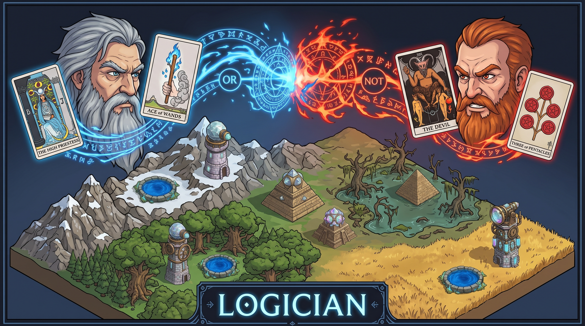
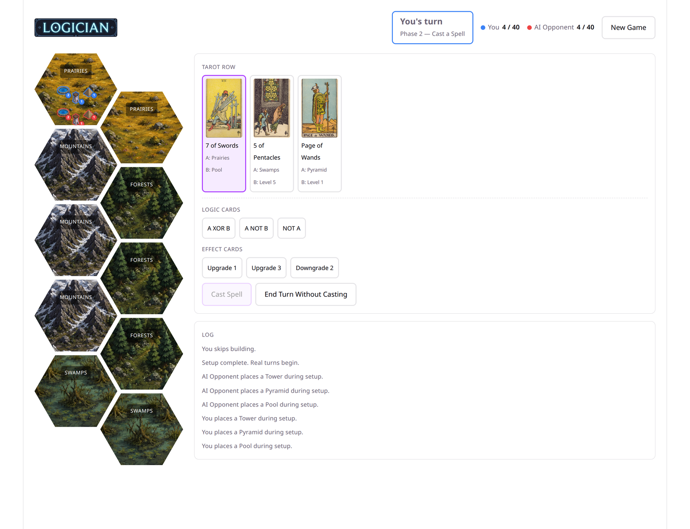

<p align="center">
  
</p>

<p align="center">
  A tabletop game where <strong>high fantasy magic meets boolean logic</strong> —
  now a browser prototype.
</p>

## What is this?

Logician started life as a physical tabletop prototype and is now a
browser-playable digital version, built with React, TypeScript, and Vite.

You and your opponents build structures on a 10-hex board, then cast **logic
spells** — `AND`, `OR`, `XOR`, `NOT A`, `A NOT B`, and more — matched against
face-up tarot cards to upgrade, downgrade, randomize, or destroy structures
across the board. Major Arcana cards layer in bigger, stranger effects (The
Devil forces your opponents to name your own targets; The Hermit lets you
search the deck; Death culls every weak structure on the board, fortresses
included). First player to **40 victory points** — the sum of your
structures' levels — wins.

<p align="center">
  
</p>

## How it plays, briefly

- **The board**: 10 hexes across four terrains — Prairies, Forests,
  Mountains, Swamps — each tied to a tarot suit (Swords, Wands, Cups,
  Pentacles respectively).
- **Structures**: Pool, Pyramid, and Tower can be built freely; a Fortress
  can only be raised once you hold all three on the same hex, and makes them
  immune to most targeting.
- **A turn** has two phases: build a structure (or skip), then either cast a
  logic spell against one of the three face-up tarot cards or play a Major
  Arcana action.
- **The logic**: each Minor Arcana tarot card encodes two operands (a
  terrain/structure-type/level pair, derived from its suit and rank). A
  Logic Card turns those into a boolean match over every structure on the
  board; an Effect Card (Upgrade, Downgrade, Maximize, Randomize, Combo) is
  then applied to everything that matches.
- **AI opponents**: any seat can be human or AI (a one-ply heuristic bot or
  a random baseline), so you can play solo, hotseat with friends, or mix
  both.

The full tabletop ruleset this prototype implements lives in
[`docs/rules.md`](docs/rules.md).

## Development

```sh
npm install
npm run dev      # start the dev server
npm run test      # run the engine test suite (vitest)
npm run build     # typecheck + production build
npm run lint       # oxlint
```

Built with React 19, TypeScript, and Vite. The game engine
(`src/engine/`) is a pure, dependency-free reducer — every rule, from spell
resolution to AI move simulation, runs through the same
`(state, action) => state` function, with no UI code involved.
